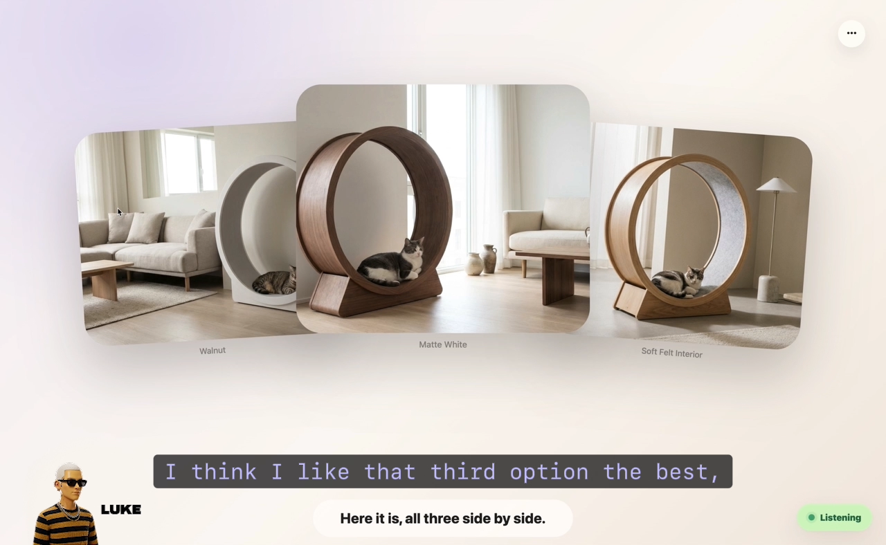

<h1 align="center">Generative UI</h1>

<p align="center">
  <b>A new way to interact with your AI agent using voice and generative UI.</b><br/>
  Talk to an agent and watch it present its thinking, visually, in real time. Powered by OpenAI Realtime for human-like conversation and the Pika MCP for live visual orchestration, the agent listens, analyzes what's being discussed, and dynamically generates the most appropriate visual composition for each response. Optional Google Workspace integration.
</p>

<p align="center">
  <a href="../LICENSE"></a>
  <a href="https://platform.openai.com/docs/guides/realtime"></a>
  <a href="https://mcp.pika.me/api/mcp"></a>
  <a href="../README.md"></a>
</p>

<p align="center">
  
</p>

> 🧪 Part of [`Pika-Experiments`](../README.md). Local-only prototype. ~3,700 lines of plain JS, **zero dependencies**, no build step. Read the source →

---

## What it does

You hold the mic and talk. The agent talks back — and **shows you what it's thinking** on a live canvas.

- 🎙️ **OpenAI Realtime** runs the voice loop (low-latency WebRTC, speech in & out).
- 🎨 **The generative canvas** — moodboards, slides, dashboards, recap cards, calendars, comparisons — emitted by the model as you converse. Layout history is navigable (← / → in the top-left) and media animates between layouts.
- 🧰 **Pika MCP** gives the agent ~60 atomic creative tools: generate images and videos, search music, lipsync, capture websites, edit audio, build brand kits.
- 📅 **Optional Google Workspace** — read calendar, draft emails, create Docs/Sheets/Slides if you connect a Google OAuth client.

Try saying: *"Make a three-image moodboard for a forest-cabin product line and put it on the canvas."*

## Prerequisites

| | Why |
|---|---|
| **Node 18+** | Runs the server. No `npm install` — there are no deps. |
| **OpenAI API key** with Realtime access | Powers the voice loop. Pay-as-you-go. Get one at [platform.openai.com/api-keys](https://platform.openai.com/api-keys). |
| **A Pika account** | OAuths into `mcp.pika.me` on first **Connect Pika** click. Sign up at [pika.me](https://www.pika.me/). Pika MCP is required — the experiment uses it as the agent's live tool layer. |
| **Chromium-based browser** | WebRTC + `getUserMedia`. Chrome, Edge, Brave, Arc all work. |
| *Google OAuth client (optional)* | Only if you want Gmail / Calendar / Drive / Docs. [Create one here.](https://console.cloud.google.com/apis/credentials) |

## Run it

```bash
git clone https://github.com/Pika-Labs/Pika-Experiments.git
cd Pika-Experiments/generative-ui

bash scripts/set-openai-key.sh   # prompts for your OpenAI key (hidden), writes .env (chmod 600, git-ignored)
npm start                         # boots node server.js on :3000
```

Open **http://localhost:3000**, click the mic, start talking. Then open the `...` menu and click **Connect Pika** to enable the creative toolset.

### Optional: connect Google Workspace

1. Create an **OAuth 2.0 Web client** in [Google Cloud Console → Credentials](https://console.cloud.google.com/apis/credentials).
2. Add redirect URI exactly: `http://localhost:3000/api/google/oauth/callback`.
3. Add the client ID/secret to `.env` (`GOOGLE_CLIENT_ID`, `GOOGLE_CLIENT_SECRET`).
4. Restart, open the `...` menu, click **Connect Google**.

> ⚠️ Default scopes are **broad** (calendar, gmail.send, drive, docs, sheets, slides, tasks, contacts). Audit `GOOGLE_SCOPES` in [`server.js`](./server.js) before approving if you want a narrower grant.

## Environment

See [`.env.example`](./.env.example) for the full template.

| Var | Required? | Default | What it does |
|---|---|---|---|
| `OPENAI_API_KEY` | yes | — | Realtime + transcription. |
| `OPENAI_REALTIME_MODEL` | no | `gpt-realtime-2` | Voice model. |
| `OPENAI_REALTIME_VOICE` | no | `marin` | Voice the agent speaks in. |
| `PIKA_MCP_URL` | no | `https://mcp.pika.me/api/mcp` | Upstream MCP. Override for self-hosted. |
| `GOOGLE_CLIENT_ID` / `GOOGLE_CLIENT_SECRET` | Google only | — | OAuth Web client. |
| `PORT` | no | `3000` | Local server port. |

## How it works

```
Browser ──WebRTC──► OpenAI Realtime ──tool calls──► Node server ──MCP──► mcp.pika.me
   ▲                       │                              │                  + Google APIs
   │  layout JSON       ◄──┘                              │
   └───────────── server-sent updates ────────────────────┘
```

- **`server.js`** — Node HTTP server. Mints ephemeral Realtime client secrets, brokers MCP (initialize / list-tools / call-tool), runs OAuth dances for Pika + Google, serves the static frontend. Layout rules live in the `STAGE_LAYOUT_PROMPT` constant at the top — including the "pick an internal art-direction theme before composing" guidance the model uses to choose between dashboard, moodboard, recipe card, brand book, etc.
- **`public/app.js`** — Browser client. Opens the WebRTC peer connection, streams the mic, renders incoming layouts, animates media between layouts (`prefers-reduced-motion` honored), runs the back/forward layout history, transcript + chat composer.
- **`public/index.html` + `styles.css`** — The canvas + side panel. The canvas is transparent so the agent has room to compose.

## Troubleshooting

| Symptom | Likely cause | Fix |
|---|---|---|
| "OpenAI API key missing" | `.env` not loaded | Confirm `.env` is in this folder with `OPENAI_API_KEY=sk-...`; restart. |
| Mic does nothing | Browser blocked `getUserMedia` | Reload over `http://localhost:3000` (not `127.0.0.1`); approve mic. |
| Pika tools fail with 401 | Token expired / not connected | `...` menu → **Connect Pika** again. Delete `.pika-token.json` if it loops. |
| No Google button | OAuth creds missing | Add `GOOGLE_CLIENT_ID` + `GOOGLE_CLIENT_SECRET`; restart; hard-refresh. |
| Realtime ends instantly | OpenAI org lacks Realtime access | Confirm `gpt-realtime-2` (or your pinned model) is enabled for the org. |
| Canvas stays blank | Model didn't emit a layout this turn | Ask explicitly: *"Show that on the canvas as a moodboard."* |

## Security

- `.env`, `.pika-token.json`, `.google-token.json` are git-ignored and chmod-restricted. **Never commit them.**
- The server is built for **single-user local dev**. There's no CSRF/auth on the local API. **Don't expose it to the public internet** without your own auth in front.
- Google scopes are broad — audit before connecting.

Disclosure: see [`SECURITY.md`](../SECURITY.md) at the repo root.

## License

Apache 2.0 — inherits from the [root `LICENSE`](../LICENSE).
