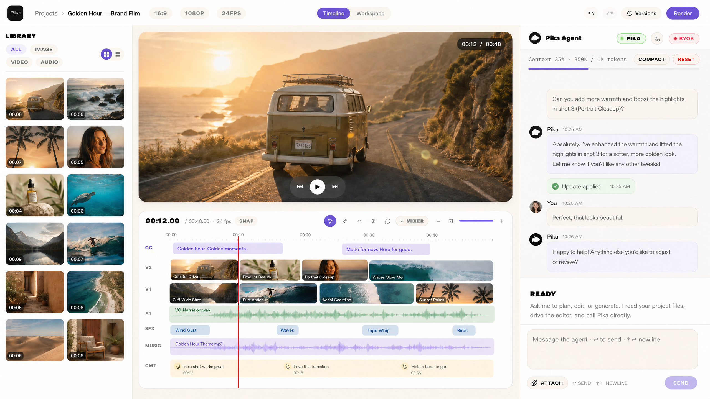

<h1 align="center">PikaAgentEditor</h1>

<p align="center">
  Agent-first video editing for Pika MCP generations.<br/>
  A local browser editor for cutting, captioning, reviewing, and rendering video projects on a real timeline, with an in-app Claude agent that plans the edit, generates assets through the Pika MCP, resolves comments, and writes back to the timeline.
</p>

<p align="center">
  <a href="../LICENSE"></a>
  <a href="https://console.anthropic.com"></a>
  <a href="https://platform.openai.com/docs/guides/realtime"></a>
  <a href="https://mcp.pika.me/api/mcp"></a>
  <a href="../README.md"></a>
</p>

<p align="center">
  
</p>

> Part of Pika-Experiments. Local-only prototype: runs on `127.0.0.1`, single user, no auth. About 23k lines of TypeScript/TSX across an npm workspace (`server` + `client`). Every clip is an MP4.

---

## What it does

You assemble a timeline in the browser. The agent works alongside you in the right rail: generating, captioning, resolving feedback, and writing results straight back into the edit.

- A real editor. V1/V2 video lanes plus dynamic audio lanes, with select / blade / ripple / slip tools, clip and track gain, fades, comments, captions, versioned saves, and ffmpeg renders.
- An in-app Claude agent. The right rail is a chat with `claude-opus-4-7` (Opus 4.6, Sonnet 4.6, and Haiku 4.5 also selectable). It has scoped file and editor tools and can drive the UI directly: switch views, select clips, move the playhead, start a render, save a version.
- Pika MCP, wired in. Connect once via local OAuth and the agent gets the Pika tools as `pika_*`. Bound generations run in the background, finished assets download into the active project, and scenes and workspace tiles update over SSE.
- Audio. Web Audio preview mix, music import, instrumental music and SFX through ElevenLabs, and ffmpeg audio extraction off generated clips onto a linked lane.
- Captions. Auto-caption per scene (Whisper via Pika upload), drag-to-position with snap guides, track-locked styling with per-row overrides, burned into the render.
- A live "what's next" surface. `workspace.json` drives a Workspace view of proposals, image and video grids, comparisons, and generation progress. It's navigable through history and immutable once archived.
- Multiple projects. Switch from the modal, remember the last project per server port, guard against two servers editing one project (`.pae-server.lock`), and wrap named saves in each project's private `.git/`.

## Prerequisites

| | Why |
|---|---|
| Node.js + npm | The repo is an npm workspace with `server` and `client` packages. |
| ffmpeg + ffprobe | Imports, duration probing, audio extraction, caption trimming, scene detection, and renders. Must be on `PATH`. |
| Git | Per-project named saves use a hidden `.git/` inside each project directory. |
| Anthropic API key | The in-app text agent and the Pika MCP bridge it runs. Get one at [console.anthropic.com](https://console.anthropic.com). |
| Pika account (optional) | Pika MCP generation tools and auto-caption upload. OAuths into `mcp.pika.me` on the first Connect Pika click. Sign up at [pika.me](https://www.pika.me/). |
| OpenAI API key (optional) | Voice mode only. The server mints short-lived Realtime client secrets. [platform.openai.com](https://platform.openai.com). |
| ElevenLabs API key (optional) | SFX lane and instrumental music. Needs the `sound_generation` scope. [elevenlabs.io](https://elevenlabs.io/app/settings/api-keys). |
| Python 3 + librosa (optional) | Beat and downbeat detection (`POST /beats`) only. |

## Run it

```bash
npm install
cp server/.env.example server/.env    # fill in keys, or set them from the model pill in the UI
npm run dev                           # server :3080 + client :3081
```

1. Open http://127.0.0.1:3081.
2. Add `ANTHROPIC_API_KEY` (in `server/.env` or via the model pill) before using the chat agent.
3. Click Connect Pika in the chat panel to authorize `mcp.pika.me`.
4. Start in the scaffolded project, switch from the projects modal, or boot a specific one with `PIKA_EDITOR_PROJECT=/abs/path npm run dev`.

### A second instance

```bash
npm run dev:alt                       # server :3082 + client :3083
```

Runs a second server/client pair on different ports. Each server keeps its own last-project file, and project locks stop both instances from autosaving into the same project.

### Multi-project demo mode

```bash
npm run dev:demos                     # four pairs at once
```

Boots four demo instances, each on its own project and ports, with demo skill preload enabled (`PIKA_DEMO_MODE=1`):

| Script | Server | Client | Project |
|---|---:|---:|---|
| `dev:demo1` | 3090 | 3091 | `projects/Project-001` |
| `dev:demo2` | 3092 | 3093 | `projects/Project-002` |
| `dev:demo3` | 3094 | 3095 | `projects/Project-003` |
| `dev:demo4` | 3096 | 3097 | `projects/Project-004` |

Demo mode inlines selected Pika skill bodies (default `ugc-ads,app-sizzle,short-ads`) into the agent's system prompt so it reacts to triggers without a lookup. It is opt-in: plain `npm run dev` runs the standard editor. Enable it elsewhere with `PIKA_DEMO_MODE=1`, or choose the skills with `PIKA_DEMO_SKILLS=a,b,c`.

### Checks and builds

```bash
npm --workspace server run build      # tsc
npm --workspace client run build      # tsc && vite build
npm --workspace client run test       # vitest
```

The root package has no build script. The server build is `tsc`; the client build is `tsc && vite build`.

## Environment

The checked-in [`server/.env.example`](server/.env.example) documents the keys. All three can also be set in-app from the model pill (top-right), which writes them back to `server/.env`.

| Var | Required? | Default | What it does |
|---|---|---|---|
| `ANTHROPIC_API_KEY` | Yes (chat + Pika tools) | — | `/chat/stream` calls the Anthropic Messages API with the selected Claude model. The server stores it and returns only `hasKey` to the client. |
| `OPENAI_API_KEY` | Voice mode only | — | `/voice/session` mints an ephemeral OpenAI Realtime client secret for `gpt-realtime`; the browser connects with that, not the real key. |
| `ELEVENLABS_API_KEY` | SFX / music only | — | `/sfx/generate` and `/music/generate`. Needs `sound_generation` (plus music access for music gen). |
| `PIKA_DEMO_MODE` | No | unset | `1` preloads Pika skill bodies into the agent prompt. Set by the `dev:demo*` scripts. |
| `PIKA_DEMO_SKILLS` | No | `ugc-ads,app-sizzle,short-ads` | Comma-separated skill slugs to preload; setting it also enables demo mode. |

Runtime overrides used by the bundled scripts (not in `.env.example`): `PIKA_EDITOR_PORT`, `PIKA_EDITOR_PROJECT`, `PIKA_EDITOR_SERVER_URL`, `LOG_LEVEL`.

## How it works

```
Browser  ·  127.0.0.1:3081
  React + Zustand editor: topbar, preview, timeline, chat rail
  voice mode uses OpenAI Realtime over WebRTC
        |
        |  HTTP + SSE
        v
Fastify server  ·  127.0.0.1:3080
  routes/* API, Claude agent loop, local Pika MCP client,
  ffmpeg workers, chokidar watcher -> SSE
        |
        |-- ElevenLabs (SFX / music)
        |-- Anthropic Messages API
        |-- mcp.pika.me  (local bearer token)
        v
projects/<active>/
  timeline.json    source of truth
  workspace.json   agent's live review view
  .agent/          per-project memory
  assets/          pika, imports, sfx, music, refs
  renders/         MP4 outputs
  .git/            named-save history
```

- Client. Vite serves the React app on `127.0.0.1:3081`, keeps editor state in Zustand, autosaves `timeline.json`, and listens to one shared `/events` SSE stream.
- Server. Fastify on `127.0.0.1:${PIKA_EDITOR_PORT:-3080}`. Routes cover `/timeline`, `/projects`, `/scenes`, `/comments`, `/workspace`, `/upload`, `/sfx`, `/music`, `/captions`, `/render`, `/versions`, `/oauth/pika`, `/chat`, `/voice`, `/asset`, `/beats`, and `/events`.
- Project directory. `timeline.json` is the source of truth, written atomically (temp file + rename) and guarded by an etag on `PUT`. Chokidar watches the tree and broadcasts over SSE; the client re-fetches. `workspace.json` is the agent's live surface, `.agent/memory.jsonl` is chat history, and `assets/` holds local copies of generated and imported media.
- Pika MCP. `server/src/agent/pika-mcp.ts` connects to `https://mcp.pika.me/api/mcp` with a local bearer token (OAuth: dynamic client registration, Authorization Code, PKCE; tokens saved at `~/.config/pikaagenteditor/pika.json`, mode `0600`). Generation tools bind to a scene (`__sceneId`) or tile (`__tileId`) so the server can run them fire-and-forget, poll, download, and patch local files.
- Render. `/render` runs an ffmpeg job (trim, concat, audio mix, ASS caption burn-in, MP4), streams progress over SSE into `renders/jobs/`, and can copy the final cut to a folder you pick.

## Editor hotkeys

| Key | Action | Key | Action |
|---|---|---|---|
| `V` | Select tool | `Space` | Play / pause |
| `C` | Blade (split) | `J` / `K` / `L` | Back 1s / pause / fwd 1s |
| `B` | Ripple | `←` / `→` | Jog playhead (`Shift` = bigger) |
| `Y` | Slip | `↑` / `↓` | Prev / next clip edge |
| `N` | Comment | `0` | Fit timeline to width |
| `S` | Toggle beat snap | `+` / `-` | Zoom in / out |
| `⌘Z` / `⌘⇧Z` | Undo / redo | `⌘C` / `⌘V` / `⌘D` | Copy / paste / duplicate |
| `Delete` | Delete clip | `Home` / `End` | Jump to start / end |

## Troubleshooting

| Symptom | Likely cause | Fix |
|---|---|---|
| Chat says `ANTHROPIC_API_KEY is not set` | The agent can't reach Anthropic. | Add `ANTHROPIC_API_KEY` to `server/.env` (or set it from the model pill) and retry. |
| Voice mode says `no OPENAI_API_KEY set` | `/voice/session` can't mint a Realtime secret. | Add `OPENAI_API_KEY` to `server/.env` or set it from the model pill. |
| Connect Pika fails or the callback hangs | The OAuth callback is tied to the running `PIKA_EDITOR_PORT`, or the server restarted mid-flow. | Keep the server up through the callback, use the matching script for that instance, then restart the connect flow. |
| `[blocked] … requires a bind target` | A Pika gen ran without `__sceneId`, `__tileId`, or `__adHoc: true`. | Create a scene or tile first, then call the tool with the binding arg so the server can auto-download and patch the result. |
| Auto-caption returns `pika-not-authenticated` | Captions upload audio through Pika MCP first. | Click Connect Pika and retry. |
| SFX or music returns `ELEVENLABS_API_KEY missing` | No ElevenLabs key loaded server-side. | Add `ELEVENLABS_API_KEY` (with `sound_generation`) to `server/.env`. |
| Beat detection returns `beat detection failed` | `python3` ran but `librosa` is missing. | `pip3 install librosa`, then retry. |
| Import, extract, or render fails on a media probe | `ffmpeg`/`ffprobe` not on `PATH`. | Install ffmpeg; confirm `ffmpeg -version` and `ffprobe -version` work in the same shell. |
| Project switch returns `project locked` | Another server owns that project's `.pae-server.lock`. | Close the other server or point it at a different project; stale locks clear once the old PID exits. |
| An alternate or demo client can't reach the server | `PIKA_EDITOR_SERVER_URL` doesn't match the server port. | Use `npm run dev:alt` or `npm run dev:demos` rather than starting the client by hand. |

## Security

- `server/.env`, `.env*`, `server/agent-config.json`, `projects/`, and `.last-project*` are git-ignored. Never commit keys or project media.
- Pika OAuth tokens live outside the repo at `~/.config/pikaagenteditor/pika.json` (mode `0600`). The bearer token stays server-local; Anthropic sees tool definitions and results, never the token.
- The server binds to `127.0.0.1` with no authentication and open CORS, by design. Don't expose it to the internet or run it multi-user without putting your own auth in front.
- The in-app agent runs scoped file and bash tools (project, skills, brand-kit, and tmp roots). Asset downloads are containment-checked and the download fetch is guarded against private-network targets, but the agent still inherits the server environment. Treat the editor as a trusted local developer tool, not a sandbox for untrusted prompts.

Disclosure: see [`SECURITY.md`](../SECURITY.md) at the repo root.

## License

Apache 2.0 — inherits from the [root `LICENSE`](../LICENSE).
